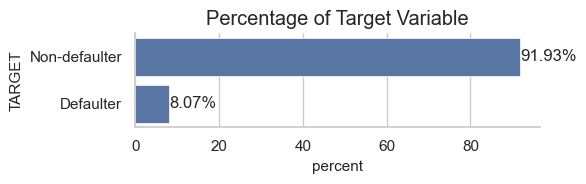
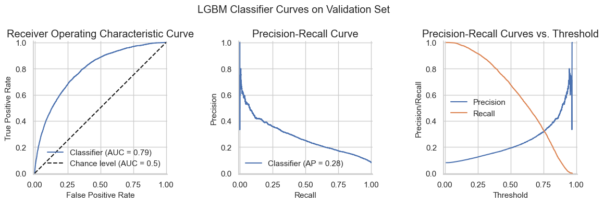
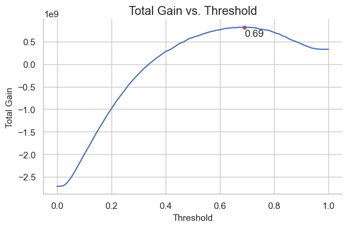
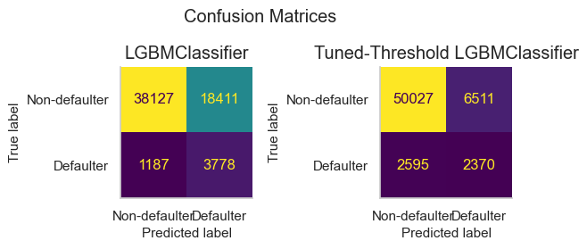
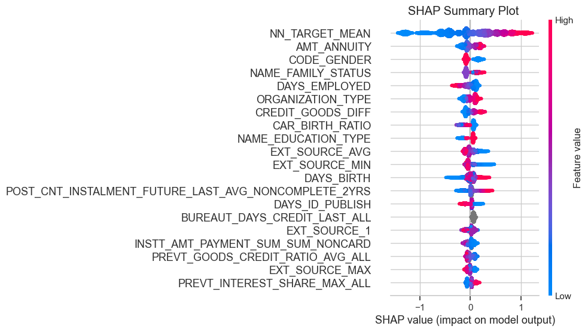
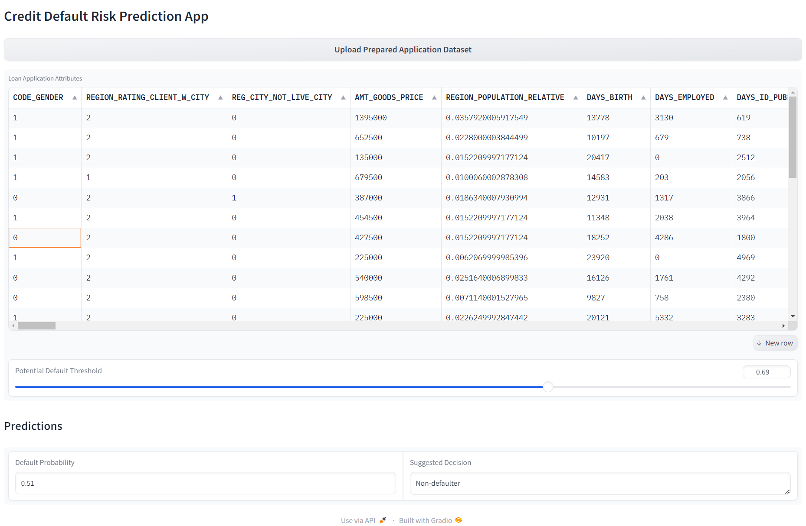

# Credit Default Risk Prediction 

## Objective and Project Plan

The **ultimate objective** of this project is to build a machine learning (ML) model to provide default risk evaluation as a service for retail banks. A plan to achieve this objective is as follows:

1. **Framing the Problem:** The goal of the business is to distinguish possible defaulters and non-defaulters as accurately as possible. Both classes are important: defaulters need to be accurately identified, however, ensuring that clients capable of repayment are not rejected is crucial. It is preferable that the default evaluation model not only predicts the class but also provides the probability so that the final decision can be made by the expert. Since we care about both classes equally, the Area Under the ROC Curve, or **ROC AUC score**, is used as the ML metric to evaluate how good the model is at ranking predictions. This is a threshold-agnostic metric, which allows setting a **threshold based on business needs**. Hence, a business metric of **total gain** is maximized by setting an appropriate classification threshold. With available data containing labels, this problem can be deemed as supervised. Naturally, the final model can be gradually improved/updated as more information about loan repayment comes in. A similar problem has been solved with a ROC AUC slightly above 0.80 using sophisticated model stacking and feature engineering. It is preferable to build a model that is less computationally expensive and easier to interpret; hence, some decrease in performance metric can be tolerated. Any expertise from the credit scoring field is valuable in developing an ML model for default risk evaluation.

2. **Data:** A dataset from [Home Credit Group](https://www.homecredit.net/) is used to build a proof-of-concept (POC) product. Home Credit strives to broaden financial inclusion for the unbanked population. In order to ensure this underserved population has a positive loan experience, Home Credit makes use of a variety of alternative data--including telco and transactional information--to predict their clients' repayment abilities.

3. **Exploratory Data Analysis:** This step is essential to understand the data at hand. Columns in the tables are analyzed in terms of their meaning, data type, missing values, usefulness for the task, possible outliers, distribution, and value range. Correlations between columns and especially univariate correlations between columns and the target are checked. This way multicollinearity and columns useful for target prediction can be identified. Exploratory data analysis also helps in coming up with promising transformations to apply to columns. Possible domain knowledge should also be utilized.

4. **Data Preparation:** Raw values in columns may lack predictive power, and hence, the data can be transformed to better expose the underlying patterns to ML algorithms. This step includes treating outliers and missing values, as well as dropping columns not useful for the task. The most important part of this step is feature engineering where features may be decomposed, transformed, or aggregated. As a final step, feature scaling might be applied.

5. **Model Selection:** At this step, models with different architectures using standard parameters are trained and compared to shortlist the most promising ones. 

6. **Fine-Tuning:** Hyperparameters of the selected algorithms should be tuned to reach the highest potential of the solution. Here, a Bayesian optimization approach might help to come to the optimum hyperparameter choices more quickly. After fine-tuning, the model's performance on the test set is measured to estimate the generalization error.

7. **Presenting the Solution:** All the steps of the project plan should be clearly outlined. They will be presented in the notebooks with insights from each step leading to instructions for the next steps.

8. **Model Deployment:** The final solution will be deployed on the Google Cloud Platform using Gradio interface.

## Exploratory Data Analysis

### Dataset
The dataset is from [Home Credit Default Risk Kaggle Competition](https://www.kaggle.com/c/home-credit-default-risk). Some interesting and useful insights from previous Home Credit analyst can be found [here](https://www.kaggle.com/competitions/home-credit-default-risk/discussion/63032). Home Credit mainly does business in CIS (Commonwealth of Independent States) and SEA (Southeast Asian) countries, thus the data might be gathered from Kazakhstan, Russia, Vietnam, China, Indonesia, Phillipines. There are 3 main Home Credit products categories: revolving loan (credit card), consumer loan (point of sales loan – POS loan), and cash loan.

The following is the schema for Home Credit dataset. In [exploratory data analysis](Part1_Plan_EDA.ipynb), each table is analyzed separately with respect to target.

### Target Imbalance
In the dataset, high target imbalance can be observed.

### Statistical Inference
One-way ANOVA and Kruskal-Wallis tests are performed to check if distributions of numerical features between samples of different targets are statistically significantly different. The one-way ANOVA tests the null hypothesis that two or more groups have the same population mean. The Kruskal-Wallis H-test tests the null hypothesis that the population median of all of the groups are equal. Feature is deemed significantly different for different targets if null hypotheses of both tests are rejected with p-value less than significance level alpha of 0.05. Chi-square test is performed to compute the chi-square p-value for the hypothesis test of independence of the observed frequencies in the contingency table. The null hypothesis is that categorical feature and target are unrelated. Feature is deemed significantly different for different targets if null hypothesis is rejected with p-value less than significance level alpha of 0.05.

### Insights
1. The dataset from Home Credit is **heavily imbalanced** with defaulters constituting 8.07%.
2. There is varying proportion of **missing values** in certain columns throughout all tables, which need to be taken care of or imputed.
3. Some columns may indicate **outlier instances**, which could be considered for removal, but also may be kept to reflect the true distribution of the data.
4. There are some cases there missing values in day columns are encoded as 365243, and missing values are encoded as XNA in categorical columns. These should be adequately be taken care of. Also, XAP means non-applicable in this dataset.
5. A big proportion of columns do not show significant or show only very weak correlation with target. However, their **importance might be boosted** by some transformations, aggregations and feature engineering in general.
6. Static columns from the main Home Credit applications table **significantly related to the target variable**: external sources, apartment size, age, gender, employment history length, days passed since registration, ID publication, and last phone change, number of defaulters in social surroundings, occupation type and organization, income type, education level, marital status, housing type, providing work or personal phone, matching registration, contact and work regions, providing certain document, loan type, living region. However, transformations of columns related to amounts might also show some relationship to target.
7. More than **80% of applicants had loans from other institutions**, but defaulters tended to have these loans less often. Columns about active credits, type and recency of those credits may provide information about probability of default. Amount and count features on loans from other institutions are not correlated to the target in absolute values.
8. **Historical balance information** on loans from other institutions is related to the target, and features engineered using this data might help in predicting default.
9. Most of the current applicants have **already applied for Home Credit loan before**, but the proportion is slightly lower for defaulters. Columns in the previous applications table significantly related to the target variable: down payment, decision days, payment count, status, yield group, product type, seller domain, channel type, application time.
10. Most of the current applicants have **POS or cash loans from Home Credit** they payed or pay installments for. Columns describing balance of these loans are not directly related to target and some aggregations and transformations are needed to uncover their potential.
11. Only around a third of current applicants have **credit cards with Home Credit**. Slightly more often they are defaulters. Credit card amount balance of the latest month is related to target. Amount columns describing balance of credit cards are highly correlated between each other but not with the target, at least in the latest history month. Some aggregations or transformations might be needed to uncover their relation to the target.
12. Most of the current applicants have **installments on loans from Home Credit**. The recency of the latest installment is related to the target as well as the maximum number of the latest installment if it is to cover a credit card. However, transformations and aggregations of columns describing installments might be needed to uncover the relation to target.
13. Though there are features correlated to target in Home Credit dataset, smart **feature engineering is needed** to reach the full potential of this dataset in developing an ML for default prediction.

## Feature Engineering 

The focus is on enhancing the predictive capabilities of the model through informed [feature engineering](Part2_Feature_Engineering.ipynb). It involves refining the dataset to capture underlying relationships and patterns crucial for predicting credit default risk. To begin, the challenge of disparate currencies within the dataset is addressed by transforming **absolute monetary values into ratios**. This ensures consistency and comparability across different currency denominations, facilitating more accurate modeling. Drawing upon [insights](https://www.kaggle.com/c/home-credit-default-risk/discussion/64821) from the experiences of predecessors tackling similar tasks, a feature aimed at identifying the **target mean of comparable applicants** is created. Additionally, various aggregations are applied across all data tables, with diverse-span windows employed to get meaningful insights and uncover predictive patterns. 

For each table, quasi-constant and highly correlated features are identified and only the one performing best with basic logistic regression estimator is kept. After that, only relevant features are selected using `Boruta` package.

### Summary on Feature Engineering 
1. A total of 38 features (original and engineered) from the main home credit application table will be further used in modeling. Among them, the mean of the target value of the 500 closest neighbors based on external sources and the credit-annuity ratio will be included.
2. A total of 109 engineered features from the tables on previous credits and their balances from other institutions will be further used in modeling. Aggregations here were applied not only to the whole table but also separately to **active and closed credits**, as well as to **card and consumer credits**.
3. A total of 271 engineered features describing the previous applications for Home Credit loans will be further used in modeling. Aggregations here were applied not only to the whole table but also separately for **applications of different statuses and types**.
4. A total of 77 engineered features describing the balance of previous point-of-sales and cash loans from Home Credit will be further used in modeling. Aggregations were applied to the whole table, to **active loans** only, and to the **last two years**.
5. A total of 81 engineered features describing the balance of previous credit cards from Home Credit will be further used in modeling. Aggregations were applied to all credit cards, only to **active credit cards**, and only to the **last two years** and the **last two months**.
6. A total of 164 engineered features describing installments on previous loans from Home Credit will be further used in modeling. Aggregations were applied to the whole table, only to **credit card installments**, **non-credit card installments**, and to the installments from the **last one year** and the **last two years**.

## Model Selection
Details on modeling are provided in the [notebook](Part3_Modeling.ipynb).

### Various Base Models
Cross-validated metrics of various model architectures with default parameters using 31 feature from the main application table as selected through exploratory data analysis.

||AUC|Average Precision|Recall|Precision|Accuracy|Balanced Accuracy|F1|F-beta|MCC|Time|
|:-|:-|:-|:-|:-|:-|:-|:-|:-|:-|:-|
|LGBMClassifier               |**0.751**|**0.233**|0.667|0.165|0.701|**0.685**|0.265|**0.415**|**0.216**|12.258|
|RidgeClassifier              |0.739|0.212|0.667|0.157|0.685|0.677|0.255|0.405|0.203|**7.220**|
|LogisticRegression           |0.739|0.212|**0.670**|0.157|0.683|0.677|0.254|0.405|0.203|7.885|
|LinearSVC                    |0.739|0.212|0.656|0.159|0.693|0.676|0.256|0.404|0.204|479.415|
|LinearDiscriminantAnalysis   |0.738|0.212|0.017|0.443|0.919|0.508|0.033|0.021|0.074|8.865|
|XGBClassifier                |0.736|0.220|0.609|0.170|0.728|0.674|**0.265**|0.401|0.209|11.098|
|SGDClassifier                |0.729|0.200|0.657|0.152|0.676|0.667|0.247|0.394|0.191|17.119|
|RandomForestClassifier       |0.724|0.199|0.006|0.506|0.919|0.503|0.012|0.007|0.048|74.722|
|ExtraTreesClassifier         |0.719|0.201|0.002|**0.532**|**0.919**|0.501|0.004|0.003|0.029|61.300|
|QuadraticDiscriminantAnalysis|0.693|0.160|0.282|0.194|0.848|0.590|0.230|0.259|0.152|8.693|
|GaussianNB                   |0.692|0.161|0.382|0.181|0.811|0.615|0.246|0.313|0.167|7.387|
|PassiveAggressiveClassifier  |0.632|0.126|0.585|0.114|0.596|0.591|0.189|0.316|0.102|9.520|
|KNeighborsClassifier         |0.591|0.110|0.035|0.254|0.914|0.513|0.062|0.043|0.068|106.403|
|DecisionTreeClassifier       |0.539|0.091|0.161|0.146|0.856|0.539|0.154|0.158|0.075|34.172|

### Original and Engineered Features from Application Table
The top two model architectures tested out with 38 features from the main application table including engineered features.

||AUC|Average Precision|Recall|Precision|Accuracy|Balanced Accuracy|F1|F-beta|MCC|Time|
|:-|:-|:-|:-|:-|:-|:-|:-|:-|:-|:-|
|LGBMClassifier|**0.765**|**0.246**|**0.685**|0.171|0.707|**0.697**|0.274|**0.428**|**0.230**|560.124|
|LogisticRegression|0.758|0.233|0.656|**0.174**|**0.721**|0.691|**0.275**|0.422|0.227|**536.528**|

### All Features
In total, 663 features are used for predictions.

||AUC|Average Precision|Recall|Precision|Accuracy|Balanced Accuracy|F1|F-beta|MCC|Time|
|:-|:-|:-|:-|:-|:-|:-|:-|:-|:-|:-|
|LGBMClassifier|**0.789**|**0.279**|**0.695**|**0.189**|**0.734**|**0.716**|**0.297**|**0.452**|**0.258**|**663.953**|
|LogisticRegression|0.778|0.257|0.684|0.183|0.727|0.708|0.289|0.442|0.247|649.535|

### Reduced Feature Subsets
Using SHAP values, subsets of top 100, 50, 20 and 10 features are evaluated.

|LGBMClassifier|AUC|Average Precision|Recall|Precision|Accuracy|Balanced Accuracy|F1|F-beta|MCC|Time|
|:-|:-|:-|:-|:-|:-|:-|:-|:-|:-|:-|
|Top 100|0.789|0.278|0.704|0.188|0.730|0.718|0.296|0.454|0.259|613.170|
|Top 50|0.787|0.274|0.702|0.185|0.727|0.715|0.293|0.451|0.255|612.820|
|Top 20|0.773|0.255|0.696|0.175|0.710|0.704|0.280|0.436|0.238|564.059|
|Top 10|0.761|0.237|0.694|0.166|0.694|0.694|0.268|0.425|0.224|583.964|

### Parameter Tuning
Bayesian optimization library `Optuna` is used for tuning parameter of LGBM Classifier with top 100 features. Best ROC AUC value achieved is 0.792.
Best parameters:
* learning_rate 0.01,
* reg_lambda 72.6,
* reg_alpha 63.8,
* subsample 0.8,
* colsample_bytree 0.4,
* max_depth 5,
* min_child_weight 654.751,
* min_split_gain 0.457,
* n_estimators 5509.

### Threshold Tuning

The threshold of the classifier can be select to better represent business needs and favor recall or precision.

Threshold tuning is performed in order to maximize total gain. For this reason, it is assumed that all credits are taken in the same currency, that defaulters do not repay credit at all, and that average profit of credits is 10%. Cost matrix is built using average credit amount, and thus, all credits are treated equally. This is the resulting cost matrix: 
||Non-defaulter |Defaulter|
|:-|:-|:-|
|**Non-defaulter**| $0.1\times$ Average Credit | $-0.1\times$ Average Credit |
|**Defaulter**| $-$ Average Credit| 0 |

Using the cost matrix, the decision threshold optimizing the total gain on validation set is 0.69.

## Model Performance

A tuned threshold results in much lower recall. This means that it might be favorable to give out credits even to possible defaulters because profits from non-defaulters, which could have been lost due to a more conservative threshold, compensate for the non-returned credits by defaulters.

||AUC|Average Precision|Recall|Precision|Accuracy|Balanced Accuracy|F1|F-beta|MCC|
|:-|:-|:-|:-|:-|:-|:-|:-|:-|:-|
|LGBMClassifier| 0.792| 0.278| 0.678| 0.193| 0.745| 0.714| 0.300| 0.451| 0.259|
|Tuned-Threshold| 0.792| 0.278| 0.431| 0.277| 0.863| 0.666| 0.337| 0.388| 0.273|

Default probability threshold yields gain of 470 mln. on the test set, while optimized probability threshold yields gain of 1022 mln.

## Model Interpretation
Analyzing the final model, it is obvious that the most import feature is target mean of the closest 500 neighbors based on external sources and credit/annuity ratio. Other top features are also from the main application table. However, there are a couple of aggregated features from other tables among the top 20 features.

## Service Deployment

Credit Default Risk Prediction Service is deployed on `Google Cloud Platform`. It can be reached via link at: https://home-credit-fastapi-r5bhc3nhna-lm.a.run.app/app/. The model provides predictions on the preprocessed data. To test the model, a small [example dataset](X_test_example.csv) can be used. Model is deployed using `Gradio` interface and allows to select row from the dataset for prediction. It is allowed to use a different prediction threshold, which may better reflect business needs.

## Recommendations
* Fully automating default risk prediction is a difficult task, and thus, **expert knowledge** should be used to make a final decision on accepting credit applications.
* Bearing in mind that applicants come from different regions, it might be useful to **account for differences in incoming data**.
* Data coming from the **main application is the most important** in predicting default risk. Without any feature engineering and additional data, cross-validated ROC AUC is 0.751. Using feature engineering and additional data sources, it is possible to increase the metric to 0.789.
* It is important to **choose decision threshold** wisely to optimize for the relevant business metric.
* Identifying the **most similar applications** (closest neighbors in terms of data from external sources and credit/annuity ratio) is the strongest predictor of default risk.
* The model best performing in default prediction is the LGBM classifier. However, such a classic architecture as logistic regression can also be used for the task with comparable performance.

## Suggestions for Improvements
* Different models, as well as missing value imputation and categorical feature encoding techniques, could be tuned to estimate their full potential. Also, other approaches for feature selection could be used to ensure the optimal model performance.
* While tuning the decision threshold to maximize the business metric, individual credits could be weighted based on their amounts. However, it is not possible in this task because currencies are not provided, and thus credits are not directly comparable.
* It would be valuable to check if the model performs without bias for different types of applicants (e.g., based on their location, gender, age, whether they are applying for the first time).
* The deployed model could include a preprocessing and feature engineering pipeline to ensure easier scaling; however, it would make the submission of the data much more complicated.